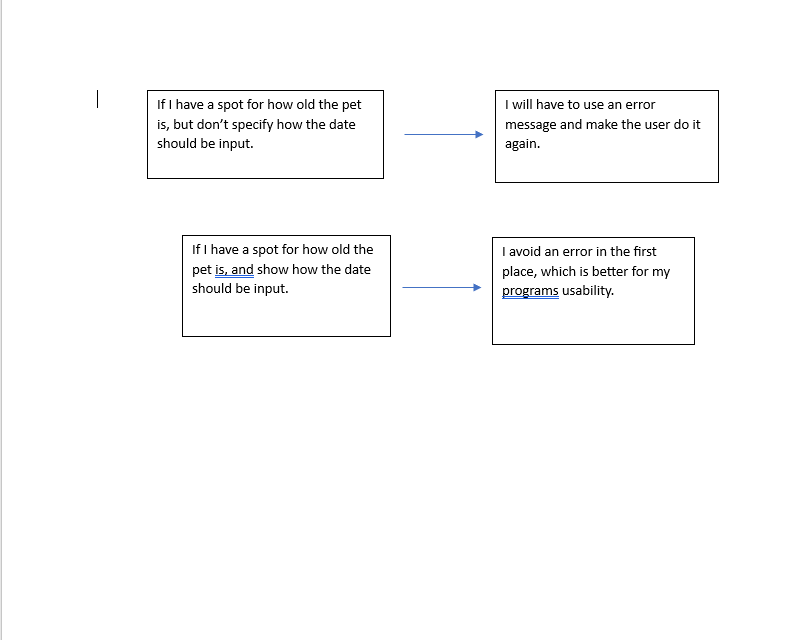

Consistency and standards
---------------------------
I would like to increase consistency and standards. My site is a little all over the place right now and I havent gotten around to making it pretty yet. More consistency with layout would help a lot I think, and is important to users. The less wondering and confusion about my site, the better.

Error prevention
----------------
I would like to increase error prevention. Error prevention is not one of my strong points, and the code to do error messages is something I dont have much experience with yet. Making sure I dont have any errors or take in errors from users in the first place is important and I should focus on that too, along with implementing error messages. 

  