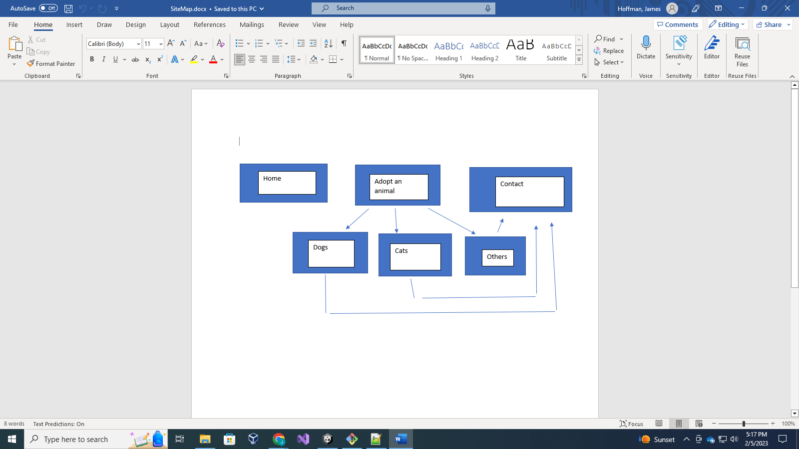

AdoptAPetFamily
===============

AdoptAPetFamily is about having a dynamic database where a user can  
find and adopt a pet of their choosing. It will have seperate pages  
for each database category of pets, and a contact page where you can  
get the adoption process started.  
  
Web Service  
-----------   
[AdoptAPet](https://www.adoptapet.com/public/apis/pet_list.html)  
Authentification Key is apiKey  

Shelter search: GET https://api.adoptapet.com/search/pets_at_shelter?key=A34F48&v=1&output=xml&shelter_id=2342

Pet search by ID: GET https://api.adoptapet.com/search/pets_at_shelter?key=A34F48&v=1&output=xml&shelter_id=2342/pets/pet_id=12
<<<<<<< HEAD

  
=======
 
>>>>>>> ed4ebf22eacffd43e595ce95f6324435d1331785
  
Database Use
------------
I will need a table for shelters, and a table for pets.
The table for shelters will have the shelter ID, address, and total pets. The shelter will have a one to many relationship with pets, where one shelter can have many pets, but one pet can only have one shelter. 
The pets table will include things like the pet ID, name, sex, age, size, species, breed, and description. 
I will need to read the shelter ID and then the pet ID, and write the things like name and age and such if thats what people are looking for in their search.
  
Initial Designs
---------------
  
  
